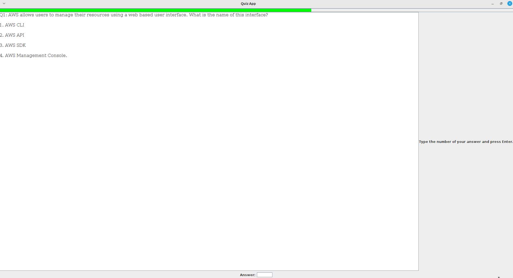

## quiz-app

A flashcard style quiz app for study purposes

```
PS.: Making this program just to help me study for the AWS Certification exams
```
----

### Project requirements:

```aiignore
Java 21

# Dependencies: see the pom.xml file
```

----

#### Fill the file 'questions.json' with your questions and answers:

----

### Build the program and run the tests:

```aiignore
mvn clean package
```

#### For Intellij just open the QuizApp.java file and hit *Run*

----

### Run the jar file:
```
java -jar target/quizapp-1.0-SNAPSHOT-jar-with-dependencies.jar
```

----

### Program visualization:



----

### Roadmap:

- [ ] Improve test coverage
- [ ] Editable fields to fill the questions.json file
- [ ] Dark theme
- [ ] English learning question.json like *Duolingo*

### License MIT